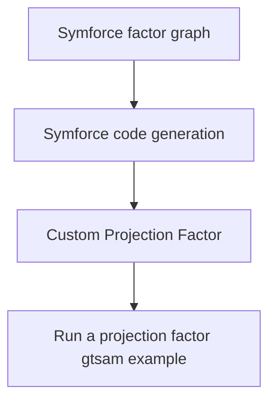

# deep_learning_covariance_modeling

**PIPELINE**

```mermaid
graph TD;
    A[Symforce factor graph]--> B[Symforce code generation];
    B --> C[Custom Projection Factor] --> D[Run a projection factor gtsam example];
```
