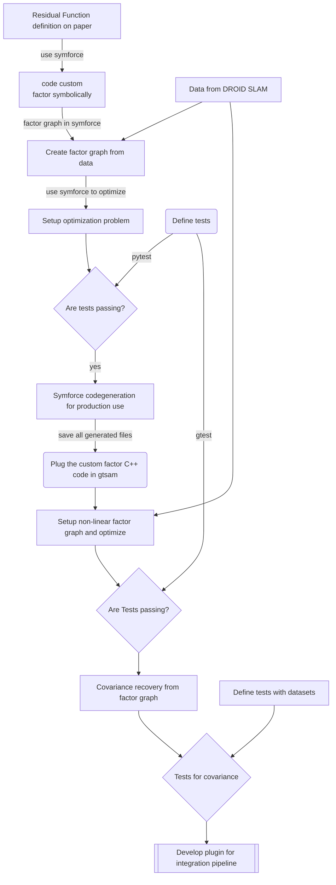

# deep_learning_covariance_modeling

**PIPELINE**

## Installation
`fmt` library - version 8.0 - 9.0. The `CMakeLists.txt` in symforce has
the `FetchContent` method implemented to download the right version. Make sure
a higher version is not already installed in your system.

## Progress
- [ ] Retrieved the factorgraph from DROID SLAM.
    - The factor graph is `.pt` file and a dictionary is saved. 
- [ ] Was able to read the `.pt` file with `libtorch` code and able to access
    the data.
- [ ] Integration of the factor graph (gtsam `c++` code) with `libtorch` was not
    successfull. There are build errors. 
    - Looks like `gtsam_4.1` and `libtorch` are incompatible for building
        together. Not sure of the cause.
    - A possible solution is to implement an adaptor data struct to convert
        everything from `tensor` outputs to a `stl` containers so that it can be 
        accessed in gtsam.
    - `Eigen` is not preferred library over `stl` because gtsam uses its own eigen 
      version. I have not yet found out a way to build everything 
      against gtsam eigen version. (Most likely solution is to figure out the
      cmakelist file package dependencies and also look at gtsam cmakelist to
      find out how it uses its own `eigen`)

- [ ] Shifting to `gtsam py` to ease out the library dependency relationship
    for creating factorgraph.
    - [ ] Need to generate python custom factor code for droid slam error
        function.
    - [ ] From droid slam code obtain the data in numpy format to be read easily
        in python instead of tensor (as well reduces dependencies on pytorch).
        Or we keep pytorch dependency as it will be more general and a good
        practise.
    - [ ] 

## GTSAM python installation

## TODO:
- [x] write `FindSymforce.cmake` for `symforce` installed libraries. There are
three libraries - `symforce_opt` for optimization, `symforce_slam` for slam
factors, `symforce_gen`.
- [ ] additionally, create a template file `cmake.in` and `pc.in` in the symforce repository
to get an autogenerated `FindSymforce.cmake` file for cmake and then make a pull
request to the [issue](https://github.com/symforce-org/symforce/issues/209), if possible
