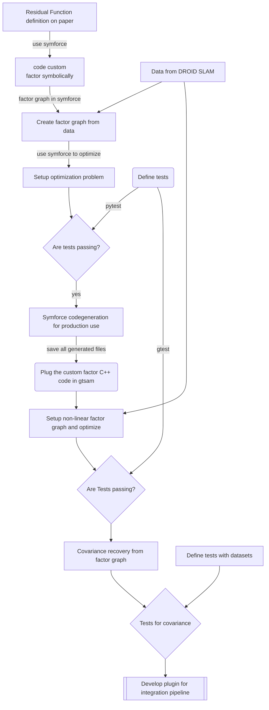

# deep_learning_covariance_modeling

**PIPELINE**

```mermaid
graph TD;
    A[Residual Function definition on paper]--use symforce--> B["code custom
    factor symbolically"];
    D["Data from DROID SLAM"]-->C;
    B-- factor graph in symforce -->C["Create factor graph from data" ];
    C--use symforce to optimize-->E["Setup optimization problem"];
    E --> F{"Are tests passing?"};
    G("Define tests")-- pytest --> F;
    F-- yes -->H["Symforce codegeneration for production use"]
    H-- save all generated files --> I("Plug the custom factor C++ code in gtsam")
    I--> J["Setup non-linear factor graph and optimize"];D-->J;
    J--> K{"Are Tests passing?"}; G--gtest-->K;
    K--> L["Covariance recovery from factor graph"];
    L--> M{"Tests for covariance"};M_["Define tests with datasets"]-->M;
    M--> N[["Develop plugin for integration pipeline"]]


```
